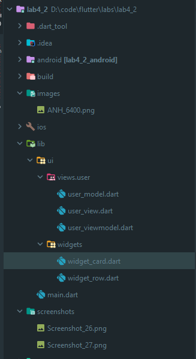
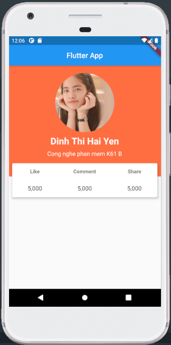

# lab4_2

A new Flutter application.

## Folder Structure



## pubspec.yaml

- Install package Stacked.
- Add link for avatar.

```yaml
stacked: ^1.7.6

  assets:
    - images/
```

## user_model.dart

```dart
class User {
  String _avatarUrl = 'images/ANH_6400.png';
  String _name = 'Dinh Thi Hai Yen';
  String _info = 'Cong nghe phan mem K61 B';

  String get avatarUrl => _avatarUrl;

  String get name => _name;

  String get info => _info;
}
```

## user_viewmodel.dart

```dart
import 'package:lab4_2/ui/views/user/user_model.dart';
import 'package:stacked/stacked.dart';

class UserViewModel extends BaseViewModel {
  User _user = User();

  User get user => _user;
}
```

## user_view.dart

```dart
import 'package:flutter/material.dart';
import 'package:lab4_2/ui/views/user/user_viewmodel.dart';
import 'package:stacked/stacked.dart';

class UserView extends StatelessWidget {
  @override
  Widget build(BuildContext context) {
    return ViewModelBuilder<UserViewModel>.reactive(
      builder: (context, model, child) => Scaffold(
        appBar: AppBar(
          title: Center(
            child: Text('Flutter App'),
          ),
        ),
        body: SafeArea(
          child: Stack(
            children: [
              Container(
                height: 300,
                width: double.infinity,
                color: Colors.deepOrangeAccent,
              ),
              Column(
                children: [
                  Container(
                    alignment: Alignment.topCenter,
                    margin: EdgeInsets.only(top: 20),
                    child: CircleAvatar(
                      radius: 80,
                      backgroundImage: AssetImage(model.user.avatarUrl),
                    ),
                  ),
                  SizedBox(height: 10),
                  Text(
                    model.user.name,
                    style: TextStyle(
                      color: Colors.white,
                      fontSize: 25,
                      fontWeight: FontWeight.bold,
                    ),
                  ),
                  SizedBox(height: 10),
                  Text(
                    model.user.info,
                    style: TextStyle(
                      color: Colors.white,
                      fontSize: 16,
                    ),
                  ),
                ],
              ),
              Container(
                margin: EdgeInsets.only(top: 260),
                padding: EdgeInsets.only(left: 5, right: 5),
                height: 100,
                width: double.infinity,
                child: Card(
                  color: Colors.white,
                  elevation: 5,
                  child: Row(
                    mainAxisAlignment: MainAxisAlignment.spaceAround,
                    children: [
                      Column(
                        mainAxisAlignment: MainAxisAlignment.spaceAround,
                        children: [
                          Text(
                            'Like',
                            style: TextStyle(
                              color: Colors.black54,
                              fontWeight: FontWeight.bold,
                            ),
                          ),
                          Text(
                            '5,000',
                            style: TextStyle(
                              color: Colors.black87,
                              fontSize: 16,
                            ),
                          ),
                        ],
                      ),
                      Column(
                        mainAxisAlignment: MainAxisAlignment.spaceAround,
                        children: [
                          Text(
                            'Comment',
                            style: TextStyle(
                              color: Colors.black54,
                              fontWeight: FontWeight.bold,
                            ),
                          ),
                          Text(
                            '5,000',
                            style: TextStyle(
                              color: Colors.black87,
                              fontSize: 16,
                            ),
                          ),
                        ],
                      ),
                      Column(
                        mainAxisAlignment: MainAxisAlignment.spaceAround,
                        children: [
                          Text(
                            'Share',
                            style: TextStyle(
                              color: Colors.black54,
                              fontWeight: FontWeight.bold,
                            ),
                          ),
                          Text(
                            '5,000',
                            style: TextStyle(
                              color: Colors.black87,
                              fontSize: 16,
                            ),
                          ),
                        ],
                      ),
                    ],
                  ),
                ),
              ),
            ],
          ),
        ),
      ),
      viewModelBuilder: () => UserViewModel(),
    );
  }
}

```

## main.dart

```dart
import 'package:flutter/material.dart';
import 'package:lab4_2/ui/views/user/user_view.dart';

void main() {
  runApp(MyApp());
}

class MyApp extends StatelessWidget {
  @override
  Widget build(BuildContext context) {
    return MaterialApp(
      home: UserView(),
    );
  }
}
```

## Result

